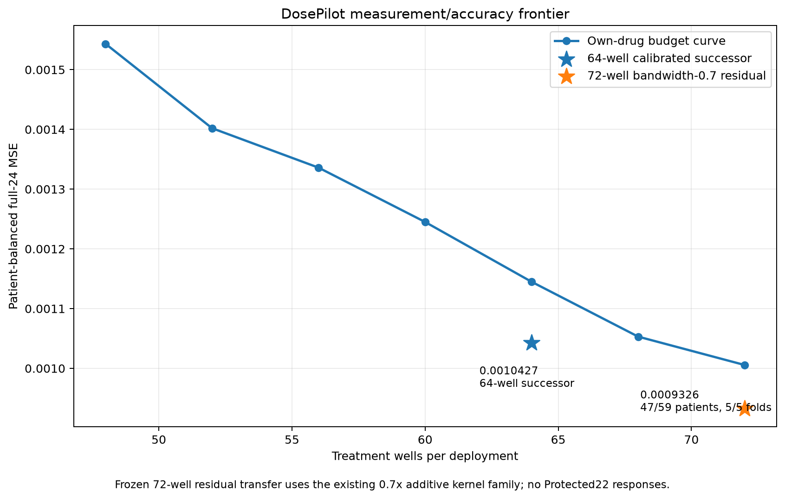

# DosePilot 72-well bandwidth-0.7 residual frontier

The 72-well all-three-dose base was established by the frozen 48–72 treatment-well curve. This study transfers the already-verified **0.7x additive cross-drug residual kernel** to that stronger base.

The study was committed as `b772b3e` before outcomes were opened.

## Result

| Procedure | Treatment wells | Patient-balanced MSE | p90 patient RMSE |
|---|---:|---:|---:|
| 72-well own-drug base | 72 | 0.001005593 | 0.038422 |
| 64-well calibrated successor | 64 | 0.001042746 | **0.037420** |
| **72-well bandwidth-0.7 residual** | **72** | **0.000932601** | 0.037707 |

Versus the frozen raw 72-well base, the new residual model delivers:

- **7.26% lower MSE**
- **47/59 patient wins**
- **5/5 favorable outer patient folds**
- **22/24 target-average wins**
- p90 patient RMSE improves from 0.038422 to **0.037707**
- descriptive whole-patient bootstrap 95% interval for candidate-minus-base loss: **[-9.58e-5, -5.11e-5]**

The independent replay verifier reconstructs the saved candidate with maximum prediction difference **0.0**.

Versus the current 64-well scientific successor, mean MSE is **10.56% lower**, with **48/59 patient wins and 5/5 favorable folds**. The trade-off is tail error: p90 patient RMSE is 0.037707 versus the 64-well successor's 0.037420.

The two target-average regressions versus raw 72 are **Methotrexate** and **Panobinostat**.

## Method

Each fitting fold:

1. rebuilds the frozen 72-well all-three-dose acquisition using fitting rows only;
2. fits the same own-drug ridge base at lambda 0.01;
3. standardizes the 72 purchased coordinates;
4. fits the existing target-group additive Gaussian residual kernel with global bandwidth multiplier **0.7**;
5. selects one of the exact existing 10 residual options using 3 whole-patient inner folds;
6. refits on the outer-training patients and predicts the held-out outer patients.

The selected residual options across the five outer folds are:

```text
fold 0: fraction 0.3, ridge 1.0
fold 1: fraction 0.1, ridge 1.0
fold 2: fraction 0.3, ridge 1.0
fold 3: fraction 0.1, ridge 1.0
fold 4: fraction 0.1, ridge 1.0
```

## Frontier interpretation

This is the lowest verified Lib1 adaptive-development MSE currently recorded for DosePilot. It does **not** replace the 64-well operating story automatically because it spends eight additional treatment wells and has slightly worse p90 tail error than the 64-well successor.



## Boundary

Repeated adaptive Lib1 development, not independent validation or clinical evidence. No Protected22 response was accessed. No patient-level rows or private prediction arrays are published.

Aggregate evidence: `evidence/budget72_bandwidth07_residual_20261006.json`

Frozen study + replay verifier: `study/budget72_bandwidth07_residual/`
