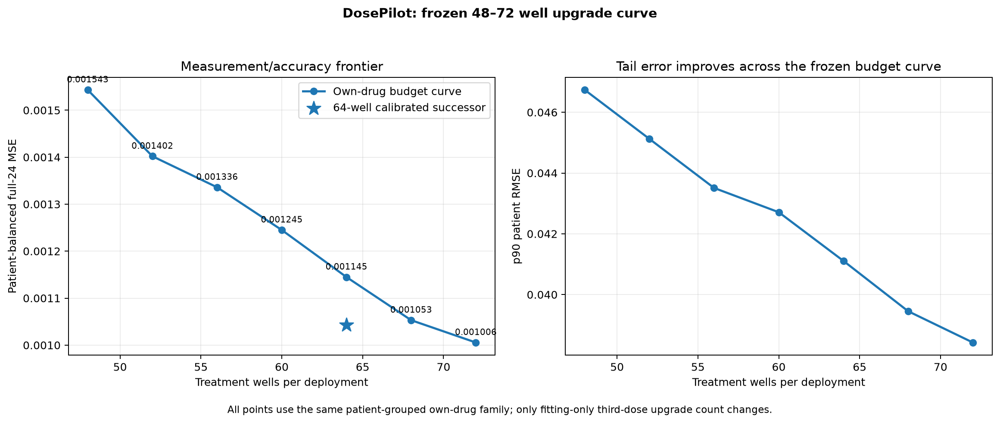

# DosePilot frozen 48–72 treatment-well curve

The seven-point budget grid was committed as `b205cf6` **before the first real-data outcomes were opened**. Every point uses the same 119 Lib1 samples, 59 whole patients, 24 targets, fitting-only size-2/size-3 allocation objective, patient-grouped outer/inner folds, ridge family, and A/B loss semantics. Only the number of fitting-only third-dose upgrades changes.

| Wells | Third-dose upgrades | MSE | p90 patient RMSE |
|---:|---:|---:|---:|
| 48 | 0 | 0.001543273 | 0.046738 |
| 52 | 4 | 0.001401987 | 0.045124 |
| 56 | 8 | 0.001335947 | 0.043509 |
| 60 | 12 | 0.001245020 | 0.042710 |
| 64 | 16 | 0.001144859 | 0.041108 |
| 68 | 20 | 0.001053103 | 0.039452 |
| 72 | 24 | **0.001005593** | **0.038422** |

The base-model curve decreases monotonically over the sampled budgets. Every adjacent four-well increase improves all **5/5 outer patient folds**.

## What this changes

The curve does **not** support the claim that 64 wells is the raw-model optimum. The 72-well all-three-dose base has the lowest raw own-drug MSE in this frozen grid.

The more useful result is that modeling moves the measurement/accuracy frontier:

- the **64-well calibrated scientific successor** has MSE **0.001042746**;
- that is **0.98% lower** than the uncalibrated 68-well point while using four fewer treatment wells;
- the 72-well raw base is **3.56% lower-MSE** than the 64-well successor, but uses **8 more wells / 12.5% more treatment measurements**.

So the current 64-well successor remains on the sampled empirical Pareto frontier: it dominates the uncalibrated 68-well point, while 72 wells occupies a lower-error, higher-measurement point.

## Boundary

This is a post-hoc repeated-development budget study on Lib1, not independent validation, a prospective laboratory cost-effectiveness experiment, or a clinical result. The entire grid and implementation were frozen before these outcomes were opened, but the underlying Lib1 population had already been repeatedly inspected during DosePilot development.

No Protected22 response was accessed. No patient-level losses or private OOF prediction arrays are published.

Machine-readable aggregate evidence: `evidence/budget_upgrade_curve_20261006.json`

Frozen study: `study/budget_upgrade_curve/`
